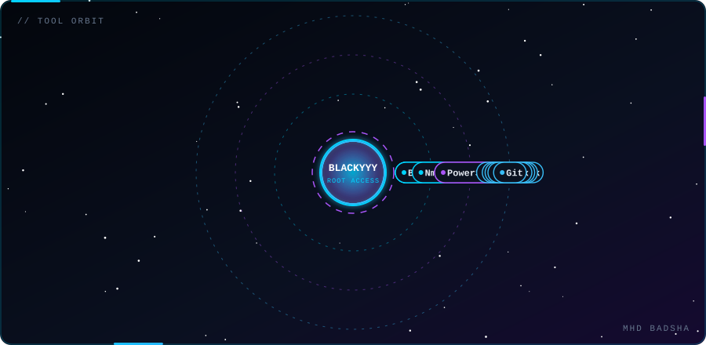
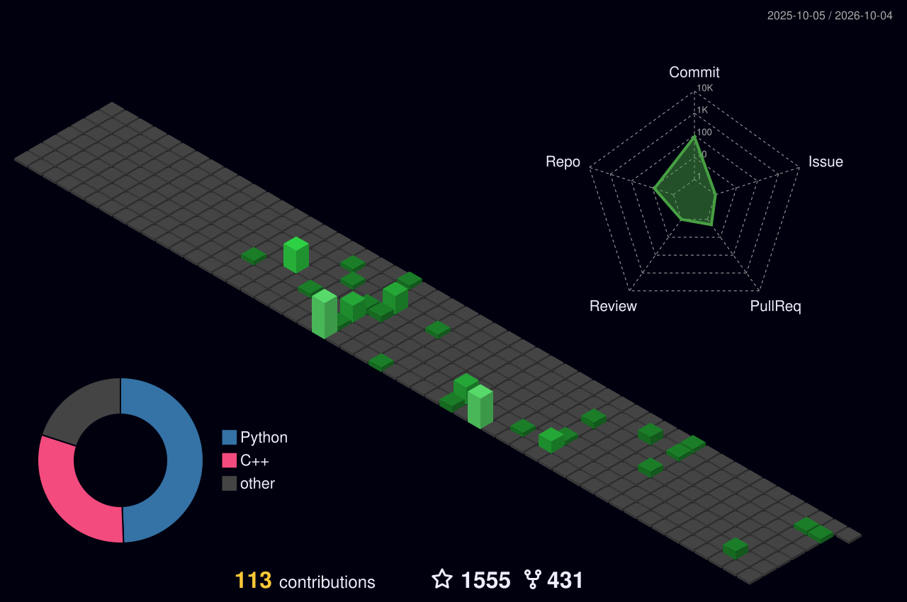

  

  

  
  &nbsp;
  
  &nbsp;
  

<!-- ───────────── PROFILE ───────────── -->

  

<!-- ───────────── TECH ARSENAL ───────────── -->

  

  

  

<!-- ───────────── GITHUB STATS ───────────── -->

  

  
  

<!-- ───────────── CONTRIBUTIONS ───────────── -->

<!-- Snake: needs .github/workflows/snake.yml to run once (creates the "output" branch) -->

  <picture>
    <source media="(prefers-color-scheme: dark)" srcset="https://raw.githubusercontent.com/Blackyyy/Blackyyy/output/github-snake-dark.svg" />
    <source media="(prefers-color-scheme: light)" srcset="https://raw.githubusercontent.com/Blackyyy/Blackyyy/output/github-snake.svg" />
    
  </picture>

<!-- 3D calendar: needs .github/workflows/profile-3d.yml to run once -->

  

<!-- Live graph: works instantly, no workflow needed -->

  

<!-- ───────────── PROJECTS ───────────── -->

  
  

  
  

<!-- ───────────── CONNECT ───────────── -->

  
  <!-- TODO: put your real website here -->
  
  
  
  <!-- TODO: replace YOUR_INSTAGRAM_ID -->
  
  
  

  

